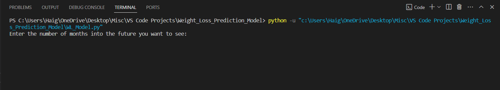
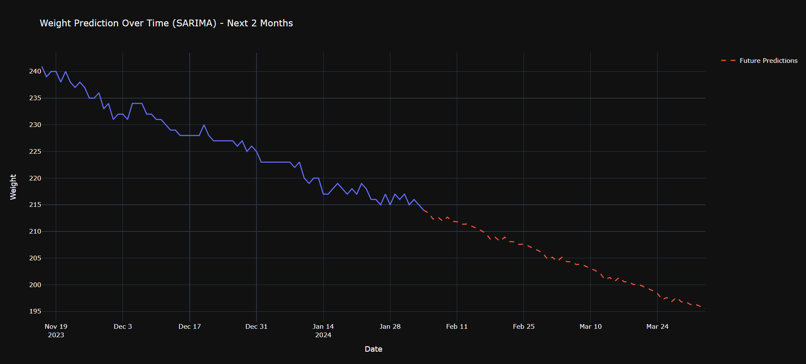
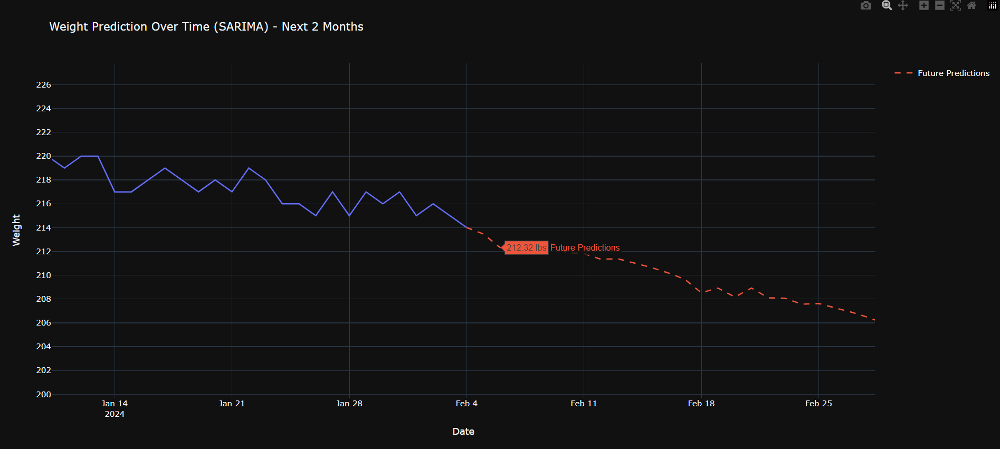

# Weight Loss Prediction Model 💪

## Overview

This project focuses on leveraging time series techniques to predict future weight changes in my weight loss journey. The predictive model utilizes time series forecasting, specifically the SARIMA (Seasonal AutoRegressive Integrated Moving Average) algorithm.

## Features

- **Time Series Forecasting:** The core of the project involves analyzing historical weight data to predict future weight trends.
  
- **SARIMA Model:** The project utilizes the SARIMA model, a statistical method, for time series forecasting. This model is chosen for its effectiveness in capturing temporal patterns.

- **Interactive Visualization:** The predictions are visualized using Plotly Express, allowing users to explore historical weight data and future predictions interactively.

## Installing Dependencies
Before running the project, make sure you have the following dependencies installed:


  ```bash
  pip install pandas numpy statsmodels plotly
  ```


## Getting Started

1. **Terminal Input:**
   
2. **Default Chart View:**
   
3. **Zoomed-In Chart View**
   

